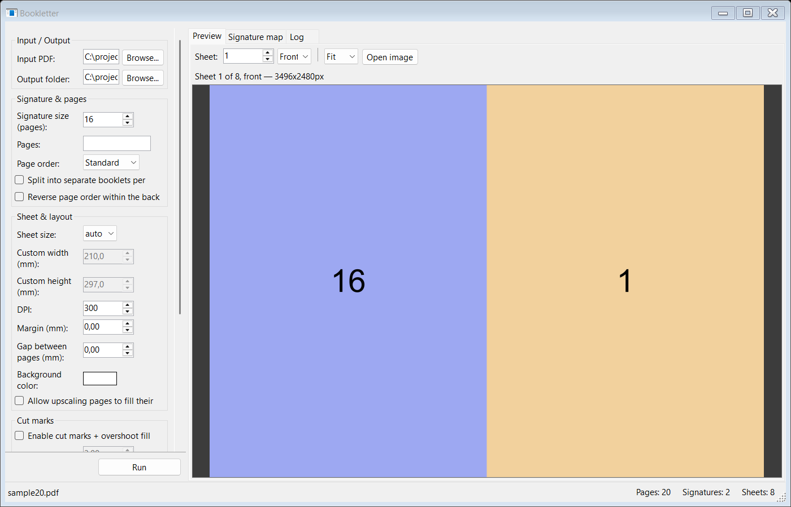
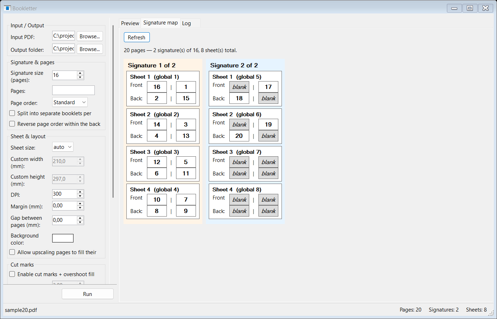
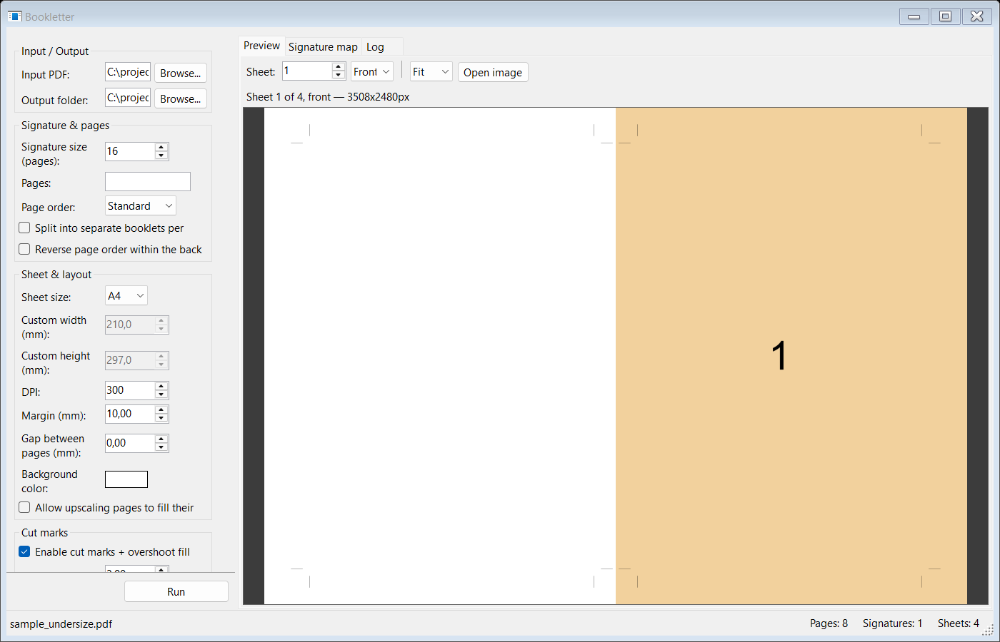

# Bookletter

A tool that imposes a single-page PDF into saddle-stitch signatures for booklet
printing: it splits the document into fixed-size signatures, works out which source
pages belong on each printed sheet (front and back), and renders ready-to-print
output. Comes as both a CLI and a WinForms GUI, sharing the same engine.

No ImageMagick or Ghostscript required — rendering is pure .NET
([PDFtoImage](https://github.com/sungaila/PDFtoImage)/PDFium,
[SkiaSharp](https://github.com/mono/SkiaSharp), and
[PDFsharp](https://docs.pdfsharp.net/)) with native binaries bundled via NuGet, so
`dotnet build`/`dotnet run` just works with no separate installs. Because every
source page is rasterized and the output PDFs are rebuilt from those bitmaps, the
output contains no vector text or embedded fonts — useful if your printer mishandles
PDFs with mapped/subset fonts.

## Screenshots

**Live preview** — check sheet size, margins, and colors before committing to a full run:



**Signature map** — the whole document's imposition at a glance, every sheet with its real page numbers:



**Cut marks + overshoot fill** — for source pages smaller than the sheet you're printing on:



## Features

- CLI and WinForms GUI sharing one imposition engine.
- Saddle-stitch imposition for any signature size (multiples of 4), with automatic
  blank-padding and splitting into multiple signatures for longer documents.
- A print-dialog-style `--pages` selector to pick and reorder which source pages are used.
- Three output modes: separate front/back files, interleaved duplex, or loose images per sheet.
- Optional split into one file set per signature, for perfect-bound/multi-signature books.
- Fixed or auto-sized output sheets, with configurable margin, gap, and background color.
- Cut marks and background overshoot fill, for printing an undersized source page onto a larger sheet.
- GUI: live auto-refreshing preview with zoom, a signature-map visualization, drag-and-drop PDF input, cancellable runs with per-sheet progress (including on the taskbar button), and a log of everything the CLI would print.

## How imposition works

A signature is a stack of sheets that get folded together and stitched down the
middle. For a 16-page signature (4 sheets), page *p* on one side of a sheet is
paired with page *(signature size + 1 - p)* on the same side, so each pair sums to
17. Concretely, sheet 1 carries pages 16 & 1 on its front and 2 & 15 on its back;
sheet 2 carries 14 & 3 front, 4 & 13 back; and so on inward. Documents that aren't an
exact multiple of the signature size are padded with blank pages at the end so the
math always works out.

If your document has more pages than one signature size, it's split into consecutive
signatures (e.g. a 40-page document with `--signature-size 16` becomes two 16-page
signatures plus one 8-page signature, blank-padded to 16), each imposed
independently — the standard approach for perfect-bound or multi-signature
saddle-stitch booklets.

## Build & run

```
dotnet build src/Bookletter
dotnet run --project src/Bookletter -- --input book.pdf --output ./out --mode all
```

Or launch the GUI (Windows only):

```
dotnet run --project src/Bookletter.Gui
```

## Usage

```
bookletter --input <file.pdf> [options]
```

| Option | Default | Description |
|---|---|---|
| `-i, --input <path>` | *(required)* | Source PDF. |
| `-o, --output <dir>` | `output` | Output directory. |
| `--signature-size <n>` | `16` | Pages per signature; must be a multiple of 4. |
| `--pages <selector>` | *(every page)* | Which source pages to use and in what order, like a print dialog's "Pages" field: comma-separated single pages and ascending ranges, 1-based, e.g. `3-20,25,30-35`. An open-ended range (`13-`) means "page 13 through the last page". |
| `--split-signatures` | off | Write one front/back/duplex file set per signature instead of one combined set. |
| `--mode <list>` | `front-back` | Comma-separated: `front-back`, `duplex`, `images`, `all`. |
| `--page-order <mode>` | `standard` | `standard` or `reversed` — swaps left/right of every pair. |
| `--reverse-back-order` | off | Reverse page order within `booklet-back.pdf` only. |
| `--sheet-size <spec>` | `auto` | `auto`, `A3`, `A4`, `A5`, `Letter`, `Legal`, or `WIDTHxHEIGHT` with unit `mm`/`cm`/`in`/`pt`. |
| `--dpi <n>` | `300` | Rasterization resolution. Higher = sharper but larger/slower. |
| `--margin <n[unit]>` | `0` | Outer margin per page cell, e.g. `5mm`. |
| `--gap <n[unit]>` | `0` | Gap between the two pages on a sheet, e.g. `3mm`. |
| `--background <hex>` | `FFFFFF` | Sheet background color. |
| `--allow-upscale` | off | Allow source pages smaller than their cell to be enlarged to fill it. |
| `--cut-marks` | off | Draw trim marks at each page's true corners and fill the surrounding cell with its detected background color (see below). |
| `--cut-mark-gap <n[unit]>` | `3mm` | Gap between the trim corner and the start of each mark; `0` for simple marks. |
| `--cut-mark-length <n[unit]>` | `5mm` | Length of each mark line. |
| `--cut-mark-stroke <n[unit]>` | `0.25pt` | Mark line thickness. |
| `--cut-mark-color <hex>` | `000000` | Mark line color. |
| `--image-format <fmt>` | `png` | `png` or `jpg`, for `--mode images`. |
| `--jpeg-quality <n>` | `90` | JPEG quality 1-100, for `--mode images`. |

### Output modes

- **`front-back`** — `booklet-front.pdf` (all sheet fronts, in sheet order) and
  `booklet-back.pdf` (all sheet backs, same order). Print fronts, flip the stack,
  print backs on the reverse. If fronts/backs end up mismatched after flipping, try
  `--reverse-back-order` — the correct fix depends on how your printer feeds and
  flips paper, which varies by device.
- **`duplex`** — `booklet-duplex.pdf`, front/back interleaved (sheet 1 front, sheet 1
  back, sheet 2 front, ...) for printers/drivers with automatic duplex printing.
  This is the most reliable option when your printer supports it, since the
  printer's duplex unit — not this tool — decides how to flip the paper.
  Recommended over `front-back` when available.
- **`images`** — one image file per sheet side, named
  `sig<NN>_sheet<NN>_front|back.<ext>`.

### Selecting pages

By default every page of the source PDF is used, in order. `--pages <selector>`
narrows and/or reorders that — the same comma-separated-ranges syntax a print
dialog's "Pages" field uses, e.g. `--pages "3-20,25,30-35"`. Anything not listed is
simply left out of the booklet entirely, the same as it never existed; page numbers
shown everywhere (console log, GUI signature map) are always the real source page
number, never a position within the selection.

An open-ended range drops the start or end: `13-` means "page 13 through the last
page", `-20` means "page 1 through 20". This is what you'd use to skip a leading
cover page - `--pages "13-"` drops the first 12 pages without needing to know the
document's total page count. Ranges must be ascending (`3-20`, not `20-3`) - this
mirrors how print dialogs work, not a general reordering tool.

### Splitting into separate booklets

By default all signatures are combined into one `booklet-front.pdf`/
`booklet-back.pdf`/`booklet-duplex.pdf` per output mode, in signature order. Pass
`--split-signatures` to instead get one file set per signature — e.g.
`booklet-front-sig01.pdf`, `booklet-front-sig02.pdf`, ... — each independently
foldable and stitchable as its own physical booklet. This is what you want for
perfect-bound or multi-signature books, where each signature is bound as a separate
unit (`--reverse-back-order`, if needed, is then applied per signature rather than
across the whole document). Loose images (`--mode images`) are already named per
signature/sheet regardless of this flag.

### Page order convention

For the outermost sheet of a signature, the *physical* saddle-stitch convention puts
the higher page number on the left and page 1 on the right (`--page-order standard`,
the default) — that's how it reads once the sheet is folded into the finished book.
`--page-order reversed` swaps left/right on every pair; use it for right-to-left
books, or if a duplex test print comes out mirrored relative to your printer's flip
direction.

### Sheet size

`auto` (the default) sizes each output sheet to exactly fit two source pages side by
side, at their native size plus any `--margin`/`--gap`. Fixed sizes (`A4`, `Letter`,
etc., or a custom `WIDTHxHEIGHT`) instead give a fixed physical sheet. By default
pages are never enlarged to fill their half (`--allow-upscale` to override) — a
source page smaller than its cell is printed at its native size and centered,
leaving a gap around it, which is exactly the situation `--cut-marks` is for.

### Cut marks and overshoot fill

`--cut-marks` is aimed at the case where your source page is a bit smaller than the
standard sheet size you're printing on (e.g. a 190×270mm design printed on A4 paper).
Enabling it does two things for each page:

1. Assumes the page has a (near-)solid background and estimates its color by
   averaging a small block of pixels a short distance in from the corner (not the
   corner pixel itself, which is prone to edge anti-aliasing/compression artifacts),
   then fills that page's entire half of the sheet — all the way to the sheet's own
   edges and to the midpoint of the inter-page gap, not just up to the page's own
   boundary — with that color, the "overshoot", so a slightly imprecise trim doesn't
   reveal a white border no matter how large your `--margin`/`--gap` is. The sampled
   color is logged to the console for each page
   (`cut-marks: page N background sampled as #RRGGBB`) so you can sanity-check it
   against pages with non-uniform backgrounds.
2. Draws trim marks at the page's true corners, showing exactly where to cut.

`--cut-mark-gap 0` gives simple marks that touch the trim corner directly. The
default (`3mm`) gives the standard print-shop style, where marks are offset from the
corner so no mark falls inside the trim/bleed zone. Both the fill and the marks need
room to work with — some combination of `--margin` and/or a `--sheet-size` bigger
than the source page — since `auto` sizing with no margin leaves no gap at all.

## Trying it out

The sample PDFs used by the screenshots above and the launch profiles below aren't
checked into the repo — generate them locally first with the throwaway tool at
[tools/SampleGenerator](tools/SampleGenerator): `samples/sample20.pdf`, a 20-page test
PDF at A5 size (each page a different color with a large page number), and
`samples/sample_undersize.pdf`, an 8-page PDF at 120×180mm — deliberately smaller than
A5 — for exercising `--cut-marks`.

```
dotnet run --project tools/SampleGenerator -- <pageCount> <outputPath> [widthMm] [heightMm]
dotnet run --project tools/SampleGenerator -- 20 samples/sample20.pdf
dotnet run --project tools/SampleGenerator -- 8 samples/sample_undersize.pdf 120 180
```

(or use its own `launchSettings.json` profiles, "Generate sample20.pdf" / "Generate
sample_undersize.pdf", to regenerate them exactly as committed.)

[src/Bookletter/Properties/launchSettings.json](src/Bookletter/Properties/launchSettings.json)
has ready-made run profiles against these sample PDFs — pick one from your IDE's
run/debug profile dropdown, or from the CLI:

```
dotnet run --project src/Bookletter --launch-profile "All outputs (16-page signatures)"
dotnet run --project src/Bookletter --launch-profile "Cut marks + overshoot fill (undersized page on A4 sheet)"
```

Profiles included: all outputs, duplex-only, split-into-separate-booklets,
skip-a-leading-cover-page, fixed A4 sheet with margin/gap, reversed page order, cut
marks + overshoot fill, cut marks + split signatures (high-res), and loose JPEG
images. Each writes into its own folder under `out/` so they don't clobber each other.

## Known limitations

- All composed sheets are held in memory (as PNG-compressed bytes) until the output
  PDFs are written, to support `--reverse-back-order` and the `duplex` interleave
  without re-rendering. This is fine for typical booklets but means very large
  documents at high DPI will use a corresponding amount of memory.
- PDFium (used for rasterization) is not thread-safe, so pages are rendered
  sequentially — expect roughly linear time in page count × DPI.
